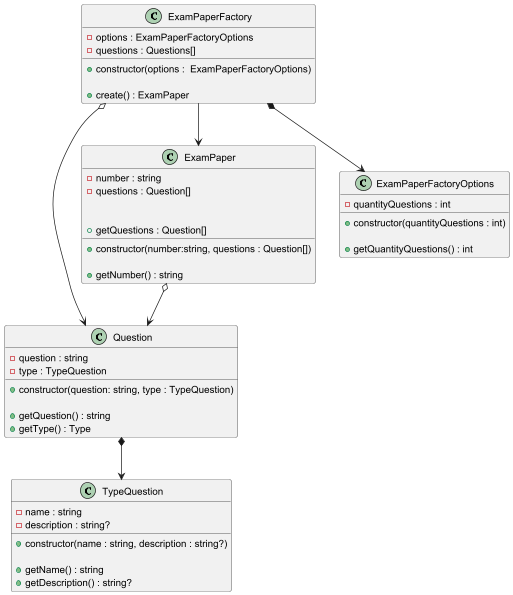



**Команда 1 (руководитель — Перевозников Леонид Михайлович)**
Горин Максим Владимирович
Шестопалов Арсений Николаевич

**Команда 2 (руководитель — Филь Хезер Евгеньевич)**
Бортников Александр Сергеевич
Евдокимов Глеб Юрьевич

**Команда 3 (руководитель — Чернятин Дмитрий Александрович)**
Галкин Иван Ильич
Твердовский Артём Иванович

**Команда 4 (руководитель — Белышев Семён Игоревич)**
Куницын Данила Алексеевич
Щепетов Лев Евгеньевич
Кондрашов Иван Владимирович

**Задание для команд. Сделать 26 марта до 12:00**
1. Создание дополнительных библиотек для реализации проекта - Команда 2
2. Создание тестов - Команда 3
3. Создание классов на основе диаграммы классов - Команда 4
4. Создание библиотеки для работы с json - Команда 1

**Планы на будщее** 
1. Интеграционные тесты использованием библиотеки для валидации 